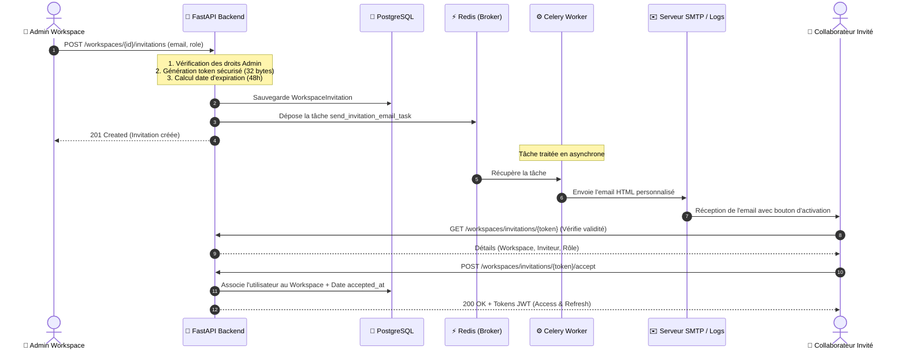
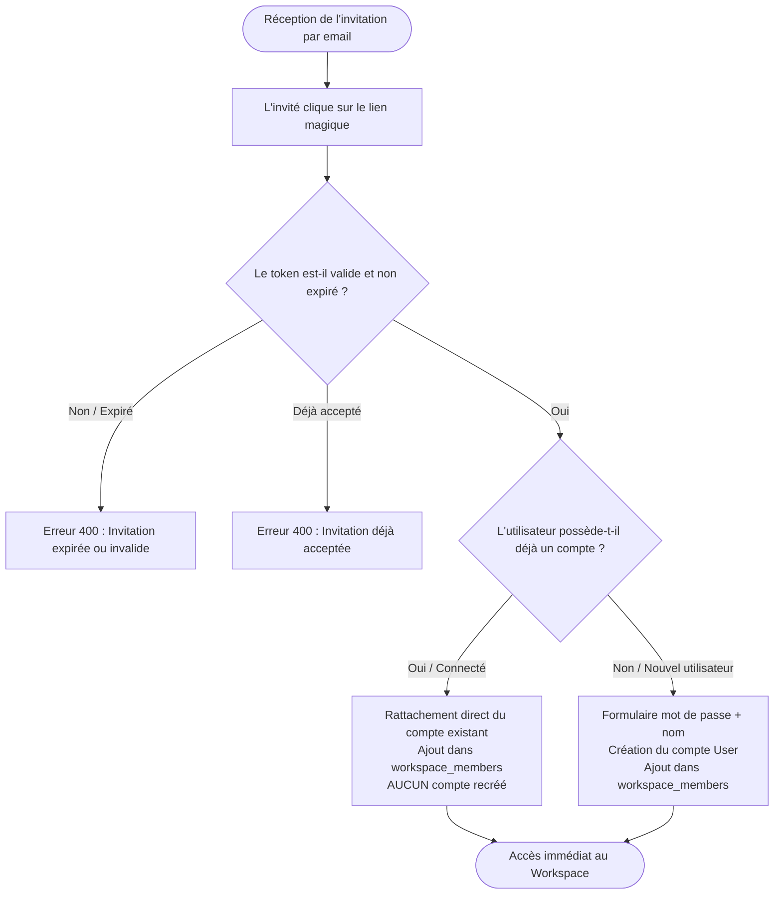

# Système d'Invitations Workspace & Notifications Email

Ce document détaille le fonctionnement, l'architecture technique, le modèle de données et les flux métiers du système d'invitations par email et de gestion multi-utilisateurs des workspaces.

---

## 1. Vue d'ensemble

Le système permet aux administrateurs de workspaces d'inviter des collaborateurs via leur adresse email. Il prend en charge :
* La génération de **liens magiques sécurisés (magic links)** avec expiration automatique (48h par défaut).
* L'envoi d'emails transactionnels HTML personnalisés via **Celery Worker** en arrière-plan.
* L'intégration transparente pour les **utilisateurs existants** (rattachement direct sans duplication de compte) et les **nouveaux utilisateurs** (onboarding et création du compte).
* La configuration SMTP standard (avec STARTTLS / SSL) et un mode de repli (*dev fallback*) qui consigne les emails dans les logs sans bloquer le développement local.

---

## 2. Diagrammes de Flux (Mermaid)

### A. Flux d'envoi et d'acceptation d'invitation



---

### B. Arbre de décision lors de l'acceptation



---

## 3. Modèle de Données

### Table `workspace_invitations`

| Colonne | Type | Description |
| :--- | :--- | :--- |
| `id` | `UUID` (PK) | Identifiant unique de l'invitation |
| `workspace_id` | `UUID` (FK) | Référence vers `workspaces.id` (`ON DELETE CASCADE`) |
| `email` | `VARCHAR` | Adresse email du destinataire (indexée) |
| `role` | `ENUM('ADMIN', 'MEMBER')` | Rôle qui sera attribué lors de l'acceptation |
| `token` | `VARCHAR` | Jeton unique cryptographique (index unique) |
| `invited_by` | `UUID` (FK) | Référence vers `users.id` (`ON DELETE CASCADE`) |
| `created_at` | `TIMESTAMP` | Date d'émission de l'invitation |
| `expires_at` | `TIMESTAMP` | Date limite de validité |
| `accepted_at` | `TIMESTAMP` | Date d'acceptation (`NULL` si en attente) |

---

## 4. Endpoints de l'API REST

Les routes sont exposées sous le préfixe `/workspaces` :

* `POST /workspaces/{workspace_id}/invitations`
  * **Accès** : Administrateur du workspace.
  * **Payload** : `{"email": "collegue@entreprise.com", "role": "MEMBER"}`.
  * **Action** : Crée l'invitation en base et déclenche la tâche Celery d'envoi d'email.

* `GET /workspaces/{workspace_id}/invitations`
  * **Accès** : Administrateur du workspace.
  * **Action** : Liste toutes les invitations actives en attente.

* `DELETE /workspaces/{workspace_id}/invitations/{invitation_id}`
  * **Accès** : Administrateur du workspace.
  * **Action** : Révoque/annule une invitation en attente.

* `GET /workspaces/invitations/{token}`
  * **Accès** : Public (non authentifié).
  * **Action** : Permet au frontend de charger les détails (nom du workspace, nom de l'inviteur, email) pour afficher l'écran d'accueil.

* `POST /workspaces/invitations/{token}/accept`
  * **Accès** : Public ou connecté.
  * **Payload** (optionnel si connecté) : `{"password": "...", "display_name": "..."}`.
  * **Action** : Valide l'invitation, enregistre l'adhésion au workspace et renvoie les tokens JWT d'authentification.

---

## 5. Configuration & Variables d'Environnement

Dans votre fichier `.env` ou `docker-compose.yml` :

```env
# Configuration SMTP (optionnelle en dev local)
SMTP_HOST=smtp.votrefournisseur.com
SMTP_PORT=587
SMTP_USER=votre_utilisateur
SMTP_PASSWORD=votre_mot_de_passe
SMTP_TLS=True
SMTP_SSL=False
EMAIL_FROM=no-reply@smartrag.local

# URL Frontend pour les liens magiques
FRONTEND_URL=http://localhost:5173

# Expiration des invitations en heures
INVITATION_EXPIRE_HOURS=48
```

> **Comportement en développement** : Lorsque `SMTP_HOST` est vide ou non renseigné, le service bascule automatiquement en mode simulation : l'email formaté et le lien d'activation sont affichés dans les logs du serveur.
